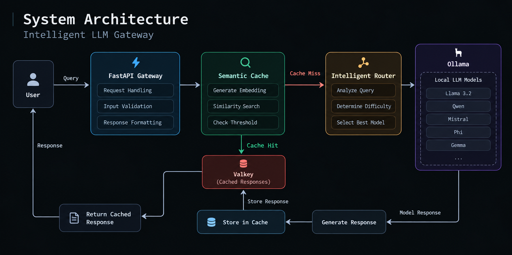

# Intelligent LLM Gateway

A local LLM gateway that intelligently routes user queries to different
models based on query difficulty, while using semantic caching to reduce
latency for repeated or similar queries.

## Architecture



## Tech Stack

- Python
- FastAPI
- Ollama
- Llama 3.2
- Qwen
- Valkey
- NumPy
- Requests

## Semantic Caching

The gateway generates an embedding for each query and compares it
against previously cached queries using cosine similarity.

If the similarity exceeds the configured threshold, the cached answer
is returned instead of running the LLM again.

## Benchmark

The cache benchmark produced:

| Metric | Result |
|---|---:|
| Cache MISS latency | 24.014 s |
| Cache HIT latency | 2.191 s |
| Speedup | 10.96× |

This demonstrates a significant reduction in latency for repeated
queries.

## Running the Project

### 1. Start Ollama

Make sure Ollama is running and the required models are available.

### 2. Start Valkey

```bash
docker start valkey